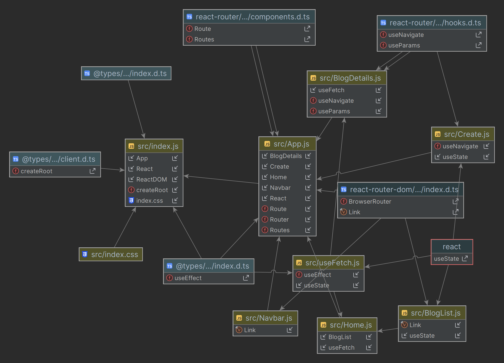

# Dojo Blog

Dojo Blog is a simple blogging platform built with React and powered by a Node.js backend. It allows users to create, read, update, and delete blog posts. The project is designed to demonstrate the integration of React with a server-side API.

## Features

- **Create:** Add new blog posts with a title, body, and author.
- **Read:** View and explore existing blog posts.
- **Update:** Edit the content of a blog post.
- **Delete:** Remove unwanted blog posts.

## Technologies Used

- **Frontend:**
    - React: A JavaScript library for building user interfaces.
    - React Router: For declarative routing in a React application.
    - Axios: A promise-based HTTP client for making requests to the backend API.

- **Backend:**
    - Node.js: A JavaScript runtime for server-side development.
    - Express: A minimal and flexible Node.js web application framework.
    - JSON Server: A simple REST API server for rapid development.

## Getting Started

1. Clone the repository: `git clone https://github.com/Abdoul-Hakim101/dojo-blog.git`
2. Navigate to the project folder: `cd dojo-blog`
3. Install dependencies:
    - For frontend: `cd client && npm install`
    - For backend: `cd server && npm install`
4. Start the frontend and backend servers:
    - Frontend: `cd client && npm start`
    - Backend: `cd server && npm start`

